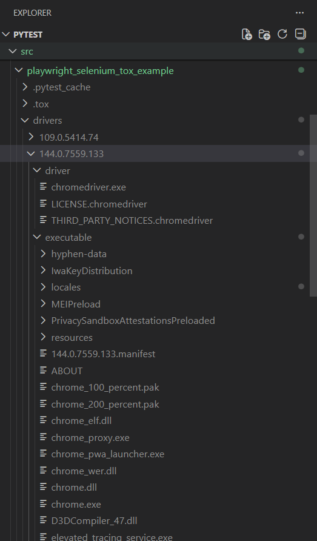

# Exemplo de Testes Automatizados usando Pytest, Tox e Poetry

Basicamente, os testes são executados em **diferentes ambientes** com o auxílio do pacote **tox**.

A necessidade de criar testes em vários ambientes se dá pelo fato de que um programa automatizado pode rodar **apenas em versões específicas do sistema operacional ou do Python**, impossibilitando sua execução em sistemas operacionais ou versões do Python mais antigos.

Por exemplo:

- Uma automação utilizando **Playwright** pode rodar apenas em **sistemas operacionais e versões do Python mais recentes**.
- Já o **Selenium**, como alternativa, pode ser utilizado para executar processos automatizados em **versões mais antigas do Python** e, consequentemente, em **sistemas operacionais mais antigos**.

Sendo assim, foram criados **vários cenários e ambientes de teste**, descritos a seguir.

---

## 🧪 Cenários de Teste

Os cenários de testes criados são:

- **Teste E2E usando Playwright**
  - Python **3.11 / 3.13**
  - Sistema operacional: **Windows 11**

- **Teste E2E usando Selenium**
  - Python **3.8**
  - Sistema operacional: **Windows 11**

- **Teste E2E usando Selenium**
  - Python **3.8**
  - Sistema operacional: **Windows 7**

---

## 📦 Instalação

Este exemplo utiliza o **Poetry** como gerenciador de dependências.

Após instalar o Poetry conforme a documentação oficial, execute o comando abaixo na raiz do projeto `pytest/src/playwright_selenium_tox_example` para instalar as dependências do projeto:

```sh
poetry install

```

# 🌐 Drivers

Os testes automatizados de exemplo que utilizam Selenium dependem de navegadores e drivers específicos, que devem ser adicionados ao projeto antes da execução dos testes.

Os testes foram executados utilizando o navegador Google Chrome, e os drivers/executáveis foram obtidos no link abaixo:

[Drivers/Navegadores](https://googlechromelabs.github.io/chrome-for-testing/)

Todos os drivers e executáveis devem ser colocados na seguinte pasta do projeto:

[](assets/exemplo_pasta_driver_executavel.png)

## 📁 Estrutura da pasta de drivers

```sh

pytest/
├── src/
    └── playwright_selenium_tox_example/
        ├── drivers/
        │   ├── 144.0.75559.133
        │       ├── driver
        │       ├── executable
        ├── src
        ├── tests

```

Detalhes

- 144.0.75559.133
Representa a versão do navegador onde o teste está sendo executado.

- driver
Pasta que deve conter o driver executável (ex: chromedriver.exe).

- executable
Pasta que deve conter o navegador executável (ex: chrome.exe).
varias versões podem ser colocados dentro da pasta drivers para ser testado.

## 🧠 Como os testes identificam qual navegador e driver usar?

No arquivo de configuração:

```sh
    tests/selenium/conftest.py
```

Na função pytest_addoption(), são definidas duas flags:

- --browser-path → caminho do executável do navegador

- --driver-path → caminho do executável do driver

Essas opções possuem valores padrão, mas podem ser sobrescritas no momento da execução dos testes, permitindo testar diferentes combinações de navegador e driver.

Caso nenhum valor seja informado, o valor default configurado será utilizado.

### ⚙️ Como o Tox define qual navegador/driver usar em cada ambiente ?

No arquivo tox.ini, estão configurados três ambientes de teste, correspondentes aos cenários descritos anteriormente.

Nos ambientes que utilizam Selenium, o Tox executa o pytest passando explicitamente os caminhos do navegador e do driver através das flags --browser-path e --driver-path.

Exemplo de configuração no tox.ini:

```sh

commands =   
    poetry run pytest selenium --browser-path=C:\xampp\htdocs\pytest\src\playwright_selenium_tox_example\drivers\144.0.7559.133\executable\chrome.exe --driver-path=C:\xampp\htdocs\pytest\src\playwright_selenium_tox_example\drivers\144.0.7559.133\driver\chromedriver.exe {posargs:tests}  

```

Estes caminhos deverão ser alterados de acordo com o local que os drivers/browsers foram instalados.

Dessa forma, cada ambiente do Tox consegue simular um cenário real de execução, variando:

- versão do Python
- sistema operacional
- navegador
- driver

## Execução dos testes automatizados

```sh

poetry run pytest

```

## Execução dos testes em diferentes ambientes com tox

Requer python : 3.8, 3.11 e 3.13 instalado.

```sh

poetry run tox

```


