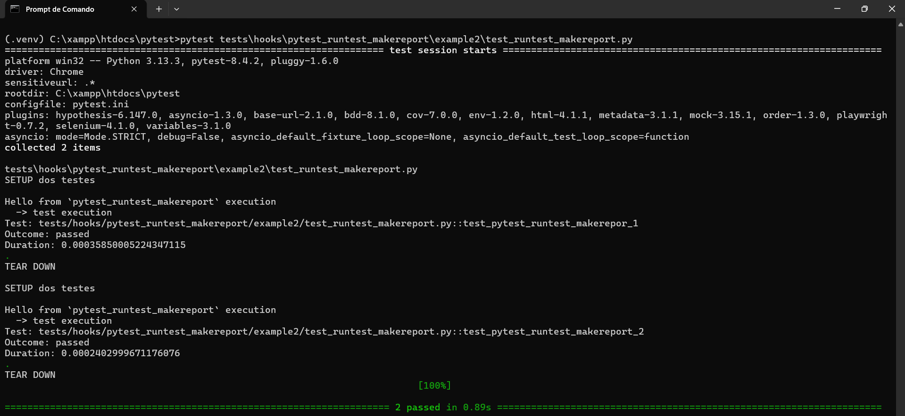

# Hooks

Atuam nas estruturas dos testes podendo alterar seu comportamento antes, durante e depois da execução dos testes. Dos mais variados hooks existentes, refiz alguns exemplos bem úteis:

## pytest_addoption
O hook da a possibilidade de criar opções na linha de comando, como por exemplo adicionar uma flag `--db-url` para testar a aplicação em um banco diferente, dentre muitas outras opções que pode ser criadas.

O hook recebe um objeto como paramêtro chamado `parser`, onde este objeto tem o metodo `addoption` que cria uma opção na linha de comando.

```sh

from pytest import hookimpl

@hookimpl()
def pytest_addoption(parser):

    parser.addoption("--env",action="store",default="testing",help="Defina o ambiente")

```

## pytest_runtest_makereport

Este hook é capaz de coletar dados de execução de cada teste e gerar relatórios personalizados depois da execução dos testes.



## pytest_collection_modifyitems

Já este hook é capaz de modificar os testes filtrando ou reordenando  por exemplo. Pode ser executado antes e depois dos testes, e ainda pode ser executado como um `wrapper` que é executado até o `yield` antes dos outros `hooks` e por ultimo, após o `yield` e depois de todos os outros `hooks`.

## pytest_sessionstart

É executado após a criação do objeto de sessão do pytest e antes da coleta dos testes.

## pytest_sessionfinish

É executado no final da execução dos testes.