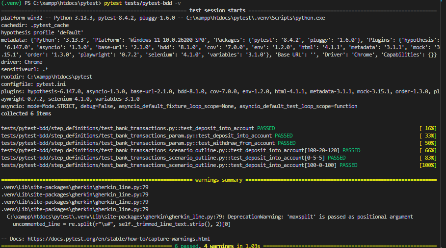

# BDD - Behavior-Driven Development

Neste tópico refiz exemplos práticos onde o `Eric` aborda como desenvolver orientado por comportamento em uma linguagem mais aproximada ao modelo de negócio.

Planilhas podem ser utilizadas para descrever cenários de teste, porém ferramentas integradas ao código permitem maior rastreabilidade entre cenário, teste e implementação, centralizando tudo no projeto.

Algumas estruturas populares para Pytest são : pytest-bdd, behave e radish. Os cenários de testes criados foram realizados em cima da ferramenta pytest-bdd.

Os arquivos na pasta `features` descrevem os cenários de negócio em linguagem Gherkin. Já a pasta `step_definitions` contém a implementação desses cenários, onde cada passo (`Given`, `When`, `Then`) é mapeado para código Python.

Os cenários são descritos baseado na `linguagem Gherkin` onde usam linguagem natural `Given-When-Then`,

Cada arquivo dentro da pasta `features` aborda diferentes formas de escrever cenários. Estes arquivos se integram aos arquivos da pasta `step_definitions`, que são responsáveis pela execução dos testes. Os testes utilizam a função `scenarios()` para carregar os cenários definidos.

## Execução dos testes 

```sh

    pytest tests/pytest-bdd -v

```

## Resultado dos cenários testados

