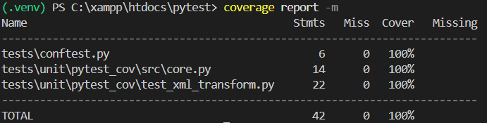

# Relatório de exemplo de cobertura de testes utlizando `Coverage`

O relátório mostra detalhadamente a porcentagem de cobertura nos testes.

## Execução dos testes com `Coverage`

```sh

    coverage run -m pytest tests/unit/pytest_cov/test_xml_transform.py

```

## Exibição do relatório no terminal
[](report_cli.png)

## Exibição do relatório em Html

Para gerar o relatório em HTML.

```sh

    coverage html

```

[](report_html.png)